# ไดอะแกรมระบบ NP Place Control

เอกสารนี้สรุปโครงสร้างและขั้นตอนจากโค้ดปัจจุบันของระบบจัดการงานกำจัดแมลง ไดอะแกรมเขียนด้วย Mermaid และแสดงความสัมพันธ์ของข้อมูลที่ระบบใช้จริง ความสัมพันธ์ระหว่างตารางที่ไม่มี foreign key ใน Prisma เป็นความสัมพันธ์เชิงตรรกะผ่านรหัสหรือชื่อ

## ไฟล์ภาพสำหรับดูและดาวน์โหลด

ภาพ SVG ด้านล่างบันทึกอยู่ใน Git และเปิดดูได้โดยตรง ภาพ Mermaid ฉบับละเอียดอยู่ในหัวข้อถัดไป

### Use Case Diagram

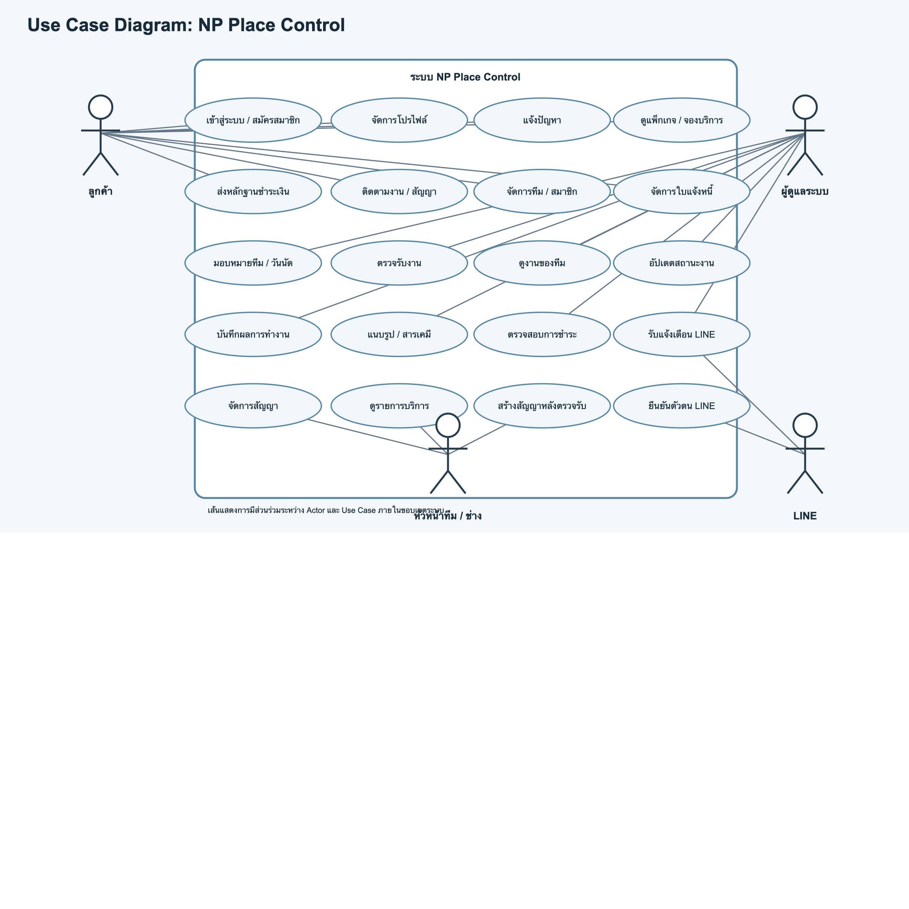

### Activity Diagram

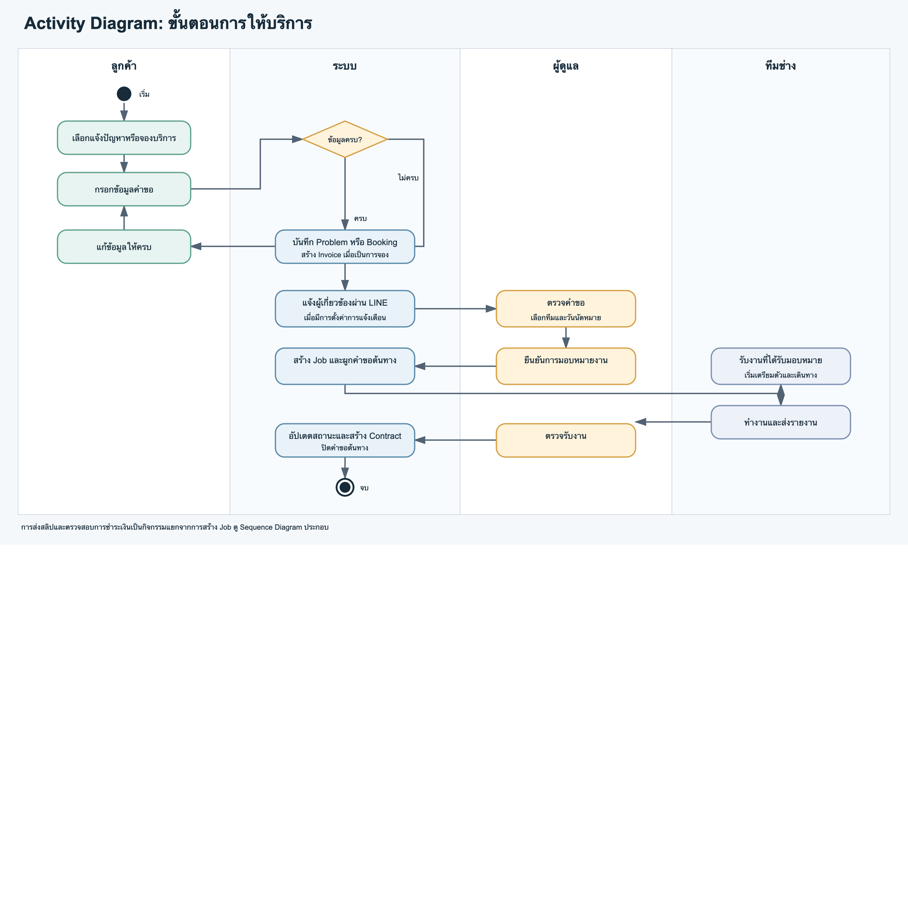

### Sequence Diagram

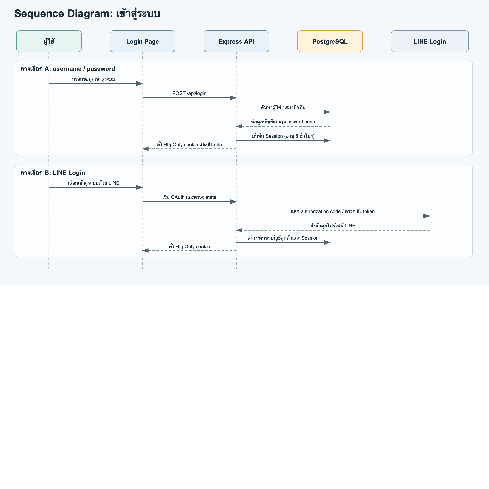

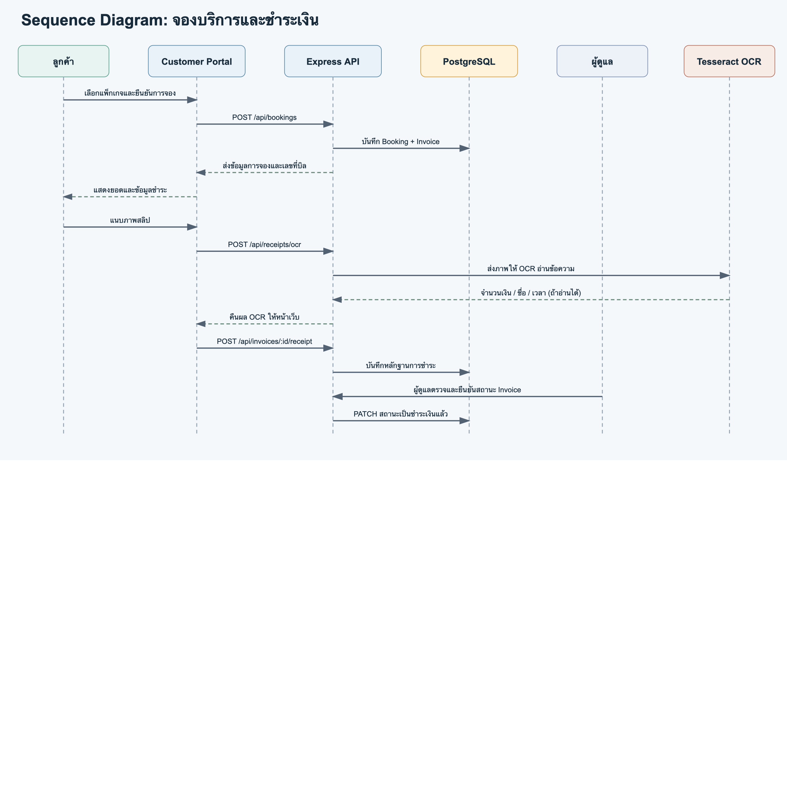

### ER Diagram

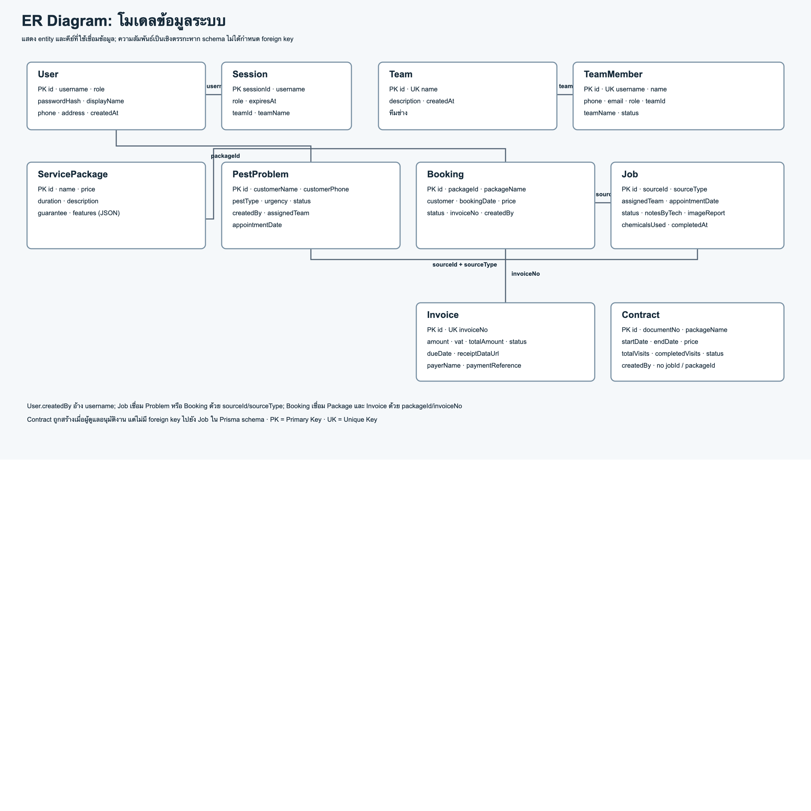

### สถาปัตยกรรมระบบ

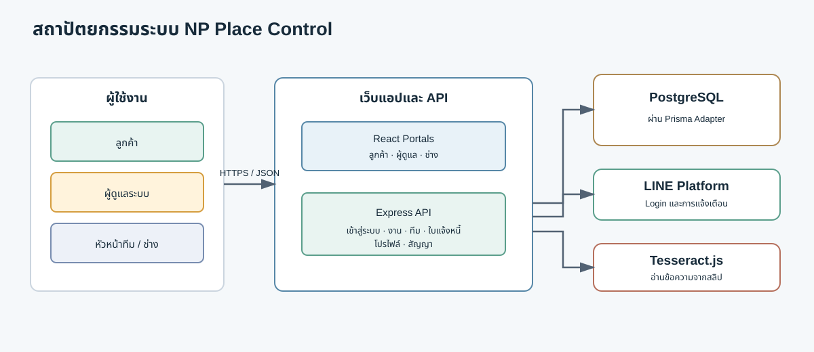

### ขั้นตอนงานบริการ

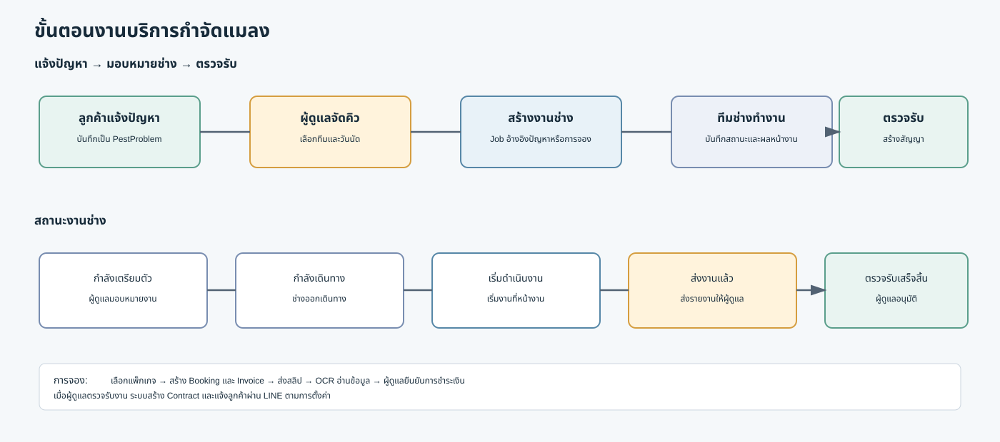

### โมเดลข้อมูล

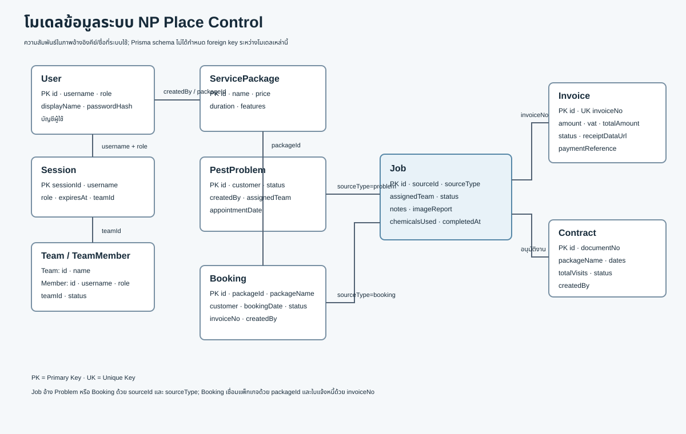

## 1. ภาพรวมและผู้เกี่ยวข้อง

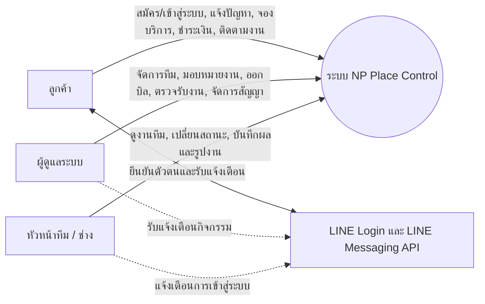
```mermaid
flowchart LR
  Customer[ลูกค้า]
  Admin[ผู้ดูแลระบบ]
  Technician[หัวหน้าทีม / ช่าง]
  LINE[LINE Login และ LINE Messaging API]
  System((ระบบ NP Place Control))

  Customer -->|สมัคร/เข้าสู่ระบบ, แจ้งปัญหา, จองบริการ, ชำระเงิน, ติดตามงาน| System
  Admin -->|จัดการทีม, มอบหมายงาน, ออกบิล, ตรวจรับงาน, จัดการสัญญา| System
  Technician -->|ดูงานทีม, เปลี่ยนสถานะ, บันทึกผลและรูปงาน| System
  Customer <-->|ยืนยันตัวตนและรับแจ้งเตือน| LINE
  Admin -.->|รับแจ้งเตือนกิจกรรม| LINE
  Technician -.->|แจ้งเตือนการเข้าสู่ระบบ| LINE
```

## 2. Use Case Diagram

แสดงขอบเขตการใช้งานตามบทบาท ลูกค้า ผู้ดูแล ช่าง และบริการ LINE

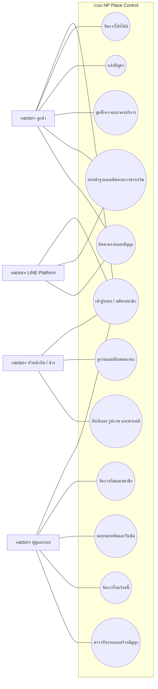
```mermaid
flowchart LR
  Customer["«actor» ลูกค้า"]
  Admin["«actor» ผู้ดูแลระบบ"]
  Technician["«actor» หัวหน้าทีม / ช่าง"]
  LINE["«actor» LINE Platform"]

  subgraph System[ระบบ NP Place Control]
    Login((เข้าสู่ระบบ / สมัครสมาชิก))
    Profile((จัดการโปรไฟล์))
    Report((แจ้งปัญหา))
    Catalog((ดูแพ็กเกจและจองบริการ))
    Payment((ส่งหลักฐานและติดตามการชำระเงิน))
    Tracking((ติดตามงานและสัญญา))
    TeamAdmin((จัดการทีมและสมาชิก))
    Dispatch((มอบหมายทีมและวันนัด))
    Billing((จัดการใบแจ้งหนี้))
    Work((ดูงานและอัปเดตสถานะ))
    WorkReport((บันทึกผล รูปภาพ และสารเคมี))
    Approve((ตรวจรับงานและสร้างสัญญา))
  end

  Customer --- Login
  Customer --- Profile
  Customer --- Report
  Customer --- Catalog
  Customer --- Payment
  Customer --- Tracking
  Admin --- Login
  Admin --- TeamAdmin
  Admin --- Dispatch
  Admin --- Billing
  Admin --- Approve
  Technician --- Login
  Technician --- Work
  Technician --- WorkReport
  LINE --- Login
  LINE --- Payment
  LINE --- Tracking
```

## 3. Activity Diagram

แสดงกิจกรรมตั้งแต่ส่งคำขอบริการจนสร้างงานให้ทีมช่างและตรวจรับ โดยคำขอเป็นได้ทั้งแจ้งปัญหาหรือการจองแพ็กเกจ

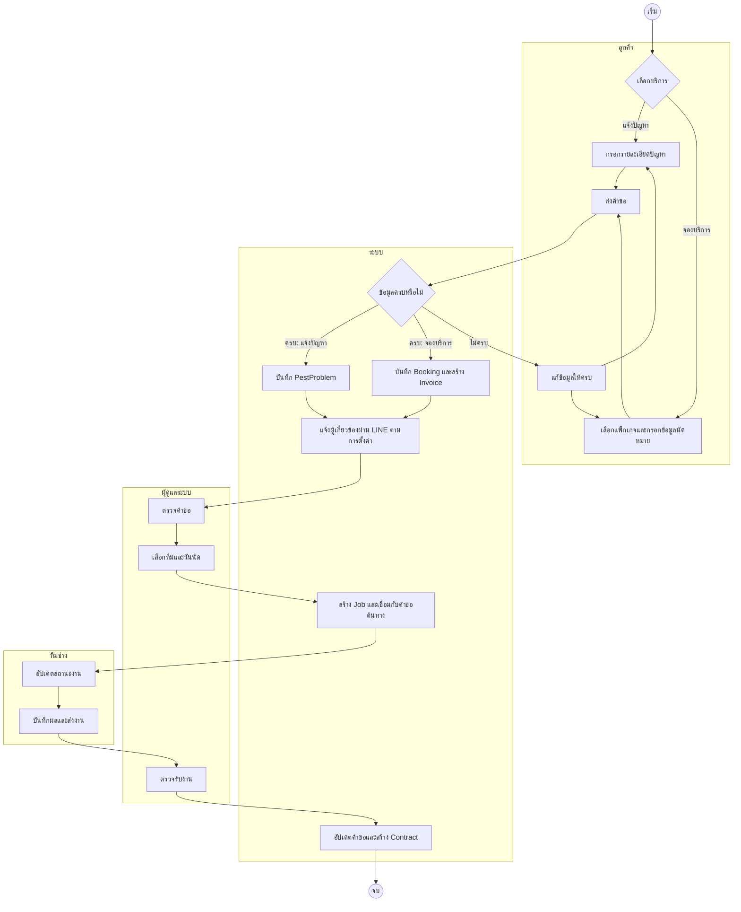
```mermaid
flowchart TD
  Start((เริ่ม)) --> Choose{เลือกบริการ}

  subgraph CustomerLane[ลูกค้า]
    Choose -->|แจ้งปัญหา| ProblemForm[กรอกรายละเอียดปัญหา]
    Choose -->|จองบริการ| BookingForm[เลือกแพ็กเกจและกรอกข้อมูลนัดหมาย]
    ProblemForm --> Submit[ส่งคำขอ]
    BookingForm --> Submit
    Fix[แก้ข้อมูลให้ครบ]
  end

  subgraph SystemLane[ระบบ]
    Submit --> Validate{ข้อมูลครบหรือไม่}
    Validate -->|ครบ: แจ้งปัญหา| SaveProblem[บันทึก PestProblem]
    Validate -->|ครบ: จองบริการ| SaveBooking[บันทึก Booking และสร้าง Invoice]
    Validate -->|ไม่ครบ| Fix
    SaveProblem --> Notify[แจ้งผู้เกี่ยวข้องผ่าน LINE ตามการตั้งค่า]
    SaveBooking --> Notify
    CreateJob[สร้าง Job และเชื่อมกับคำขอต้นทาง]
    Finish[อัปเดตคำขอและสร้าง Contract]
  end

  subgraph AdminLane[ผู้ดูแลระบบ]
    Review[ตรวจคำขอ]
    Assign[เลือกทีมและวันนัด]
    Accept[ตรวจรับงาน]
  end

  subgraph TechnicianLane[ทีมช่าง]
    UpdateStatus[อัปเดตสถานะงาน]
    SubmitReport[บันทึกผลและส่งงาน]
  end

  Fix --> ProblemForm
  Fix --> BookingForm
  Notify --> Review
  Review --> Assign
  Assign --> CreateJob
  CreateJob --> UpdateStatus
  UpdateStatus --> SubmitReport
  SubmitReport --> Accept
  Accept --> Finish
  Finish --> End((จบ))
```

หมายเหตุ: ใบแจ้งหนี้ถูกสร้างพร้อมการจอง ส่วนการส่งสลิปและการตรวจสอบการชำระเงินเป็นขั้นตอนแยกตาม Sequence Diagram ด้านล่าง

## 4. สถาปัตยกรรมส่วนประกอบ

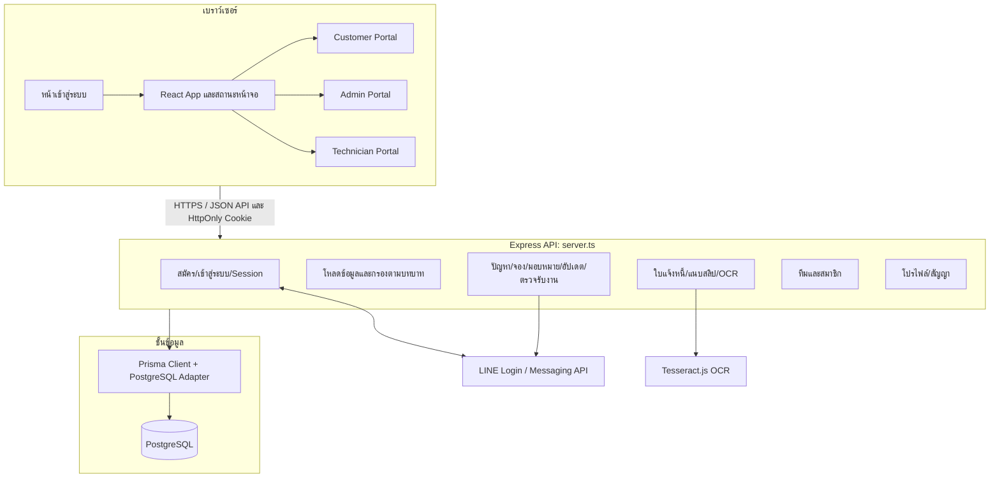
```mermaid
flowchart TB
  subgraph Client[เบราว์เซอร์]
    Login[หน้าเข้าสู่ระบบ]
    App[React App และสถานะหน้าจอ]
    CustomerUI[Customer Portal]
    AdminUI[Admin Portal]
    TechUI[Technician Portal]
    Login --> App
    App --> CustomerUI
    App --> AdminUI
    App --> TechUI
  end

  subgraph Backend[Express API: server.ts]
    Auth[สมัคร/เข้าสู่ระบบ/Session]
    State[โหลดข้อมูลและกรองตามบทบาท]
    Work[ปัญหา/จอง/มอบหมาย/อัปเดต/ตรวจรับงาน]
    Billing[ใบแจ้งหนี้/แนบสลิป/OCR]
    Teams[ทีมและสมาชิก]
    Profile[โปรไฟล์/สัญญา]
  end

  subgraph Data[ชั้นข้อมูล]
    Prisma[Prisma Client + PostgreSQL Adapter]
    DB[(PostgreSQL)]
    Prisma --> DB
  end

  LINE[LINE Login / Messaging API]
  OCR[Tesseract.js OCR]
  Client -->|HTTPS / JSON API และ HttpOnly Cookie| Backend
  Auth <--> LINE
  Work --> LINE
  Billing --> OCR
  Backend --> Prisma
```

## 5. การติดตั้งและการให้บริการ

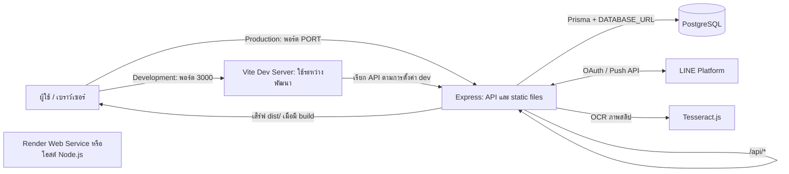
```mermaid
flowchart LR
  Browser[ผู้ใช้ / เบราว์เซอร์]
  Render[Render Web Service หรือโฮสต์ Node.js]
  Express[Express: API และ static files]
  Vite[Vite Dev Server: ใช้ระหว่างพัฒนา]
  PostgreSQL[(PostgreSQL)]
  LineApi[LINE Platform]
  Ocr[Tesseract.js]

  Browser -->|Production: พอร์ต PORT| Express
  Express -->|/api/*| Express
  Express -->|เสิร์ฟ dist/ เมื่อมี build| Browser
  Browser -->|Development: พอร์ต 3000| Vite
  Vite -->|เรียก API ตามการตั้งค่า dev| Express
  Express -->|Prisma + DATABASE_URL| PostgreSQL
  Express <-->|OAuth / Push API| LineApi
  Express -->|OCR ภาพสลิป| Ocr
```

ในโหมด production คำสั่ง `npm start` deploy Prisma migrations แล้วเริ่ม Express; Express จะเสิร์ฟไฟล์จาก `dist/` หากมีอยู่ ส่วนการพัฒนาใช้ Vite และ API บนพอร์ตที่กำหนดด้วย `PORT` (ค่าเริ่มต้น 8787)

## 6. ER Diagram (ERD)

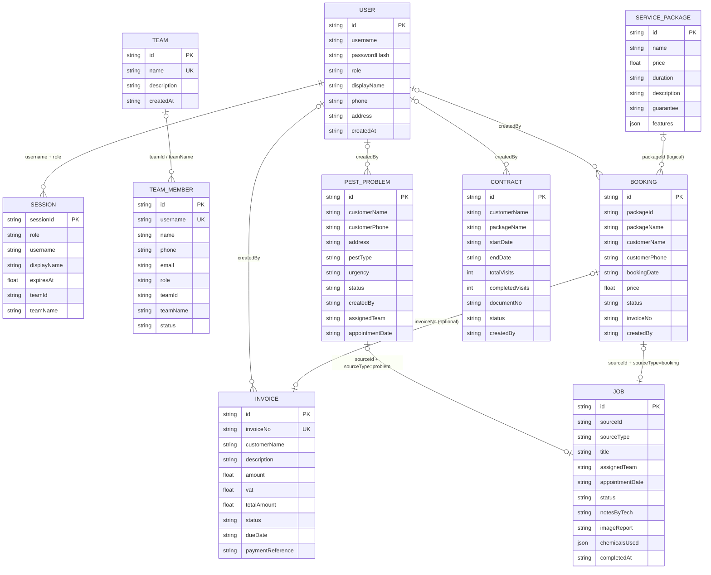
```mermaid
erDiagram
  USER {
    string id PK
    string username
    string passwordHash
    string role
    string displayName
    string phone
    string address
    string createdAt
  }
  SESSION {
    string sessionId PK
    string role
    string username
    string displayName
    float expiresAt
    string teamId
    string teamName
  }
  TEAM {
    string id PK
    string name UK
    string description
    string createdAt
  }
  TEAM_MEMBER {
    string id PK
    string username UK
    string name
    string phone
    string email
    string role
    string teamId
    string teamName
    string status
  }
  SERVICE_PACKAGE {
    string id PK
    string name
    float price
    string duration
    string description
    string guarantee
    json features
  }
  PEST_PROBLEM {
    string id PK
    string customerName
    string customerPhone
    string address
    string pestType
    string urgency
    string status
    string createdBy
    string assignedTeam
    string appointmentDate
  }
  BOOKING {
    string id PK
    string packageId
    string packageName
    string customerName
    string customerPhone
    string bookingDate
    float price
    string status
    string invoiceNo
    string createdBy
  }
  JOB {
    string id PK
    string sourceId
    string sourceType
    string title
    string assignedTeam
    string appointmentDate
    string status
    string notesByTech
    string imageReport
    json chemicalsUsed
    string completedAt
  }
  INVOICE {
    string id PK
    string invoiceNo UK
    string customerName
    string description
    float amount
    float vat
    float totalAmount
    string status
    string dueDate
    string paymentReference
  }
  CONTRACT {
    string id PK
    string customerName
    string packageName
    string startDate
    string endDate
    int totalVisits
    int completedVisits
    string documentNo
    string status
    string createdBy
  }

  USER ||--o{ SESSION : "username + role"
  USER o|--o{ PEST_PROBLEM : "createdBy"
  USER o|--o{ BOOKING : "createdBy"
  USER o|--o{ INVOICE : "createdBy"
  USER o|--o{ CONTRACT : "createdBy"
  TEAM o|--o{ TEAM_MEMBER : "teamId / teamName"
  SERVICE_PACKAGE o|--o{ BOOKING : "packageId (logical)"
  PEST_PROBLEM o|--o| JOB : "sourceId + sourceType=problem"
  BOOKING o|--o| JOB : "sourceId + sourceType=booking"
  BOOKING o|--o| INVOICE : "invoiceNo (optional)"
```

`SESSION` เก็บข้อมูลทีม ณ เวลาสร้าง session; `JOB.sourceId` อ้างได้ทั้ง `PEST_PROBLEM.id` หรือ `BOOKING.id` โดยแยกด้วย `sourceType` ระบบไม่ได้ประกาศ foreign key สำหรับความสัมพันธ์เหล่านี้ ส่วน `CONTRACT` เก็บชื่อแพ็กเกจเป็นข้อความ ไม่มี `packageId`

## 7. ขั้นตอนแจ้งปัญหาและมอบหมายช่าง

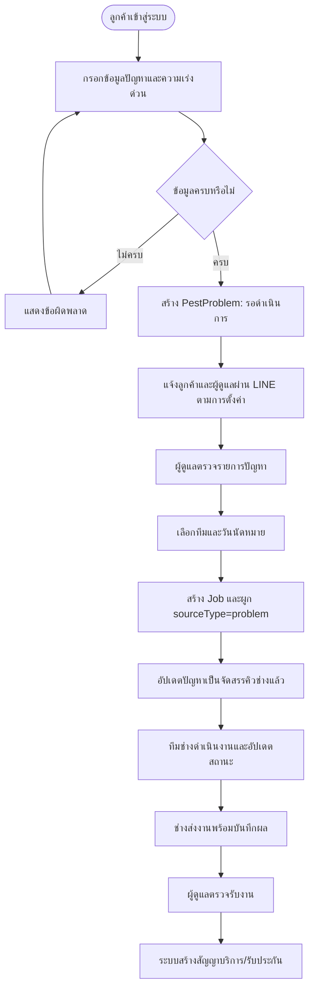
```mermaid
flowchart TD
  Start([ลูกค้าเข้าสู่ระบบ]) --> Report[กรอกข้อมูลปัญหาและความเร่งด่วน]
  Report --> Validate{ข้อมูลครบหรือไม่}
  Validate -->|ไม่ครบ| Error[แสดงข้อผิดพลาด]
  Error --> Report
  Validate -->|ครบ| SaveProblem[สร้าง PestProblem: รอดำเนินการ]
  SaveProblem --> Notify[แจ้งลูกค้าและผู้ดูแลผ่าน LINE ตามการตั้งค่า]
  Notify --> AdminReview[ผู้ดูแลตรวจรายการปัญหา]
  AdminReview --> Assign[เลือกทีมและวันนัดหมาย]
  Assign --> SaveJob[สร้าง Job และผูก sourceType=problem]
  SaveJob --> SourceAssigned[อัปเดตปัญหาเป็นจัดสรรคิวช่างแล้ว]
  SourceAssigned --> TechWork[ทีมช่างดำเนินงานและอัปเดตสถานะ]
  TechWork --> Submit[ช่างส่งงานพร้อมบันทึกผล]
  Submit --> Review[ผู้ดูแลตรวจรับงาน]
  Review --> Contract[ระบบสร้างสัญญาบริการ/รับประกัน]
```

## 8. Sequence Diagram: จองบริการและชำระเงิน

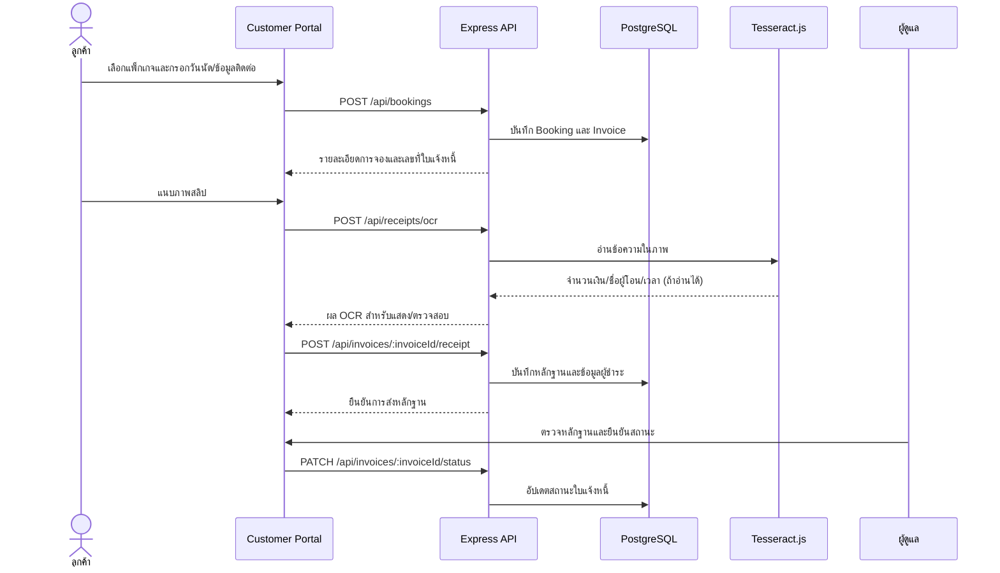
```mermaid
sequenceDiagram
  actor Customer as ลูกค้า
  participant UI as Customer Portal
  participant API as Express API
  participant DB as PostgreSQL
  participant OCR as Tesseract.js
  participant Admin as ผู้ดูแล

  Customer->>UI: เลือกแพ็กเกจและกรอกวันนัด/ข้อมูลติดต่อ
  UI->>API: POST /api/bookings
  API->>DB: บันทึก Booking และ Invoice
  API-->>UI: รายละเอียดการจองและเลขที่ใบแจ้งหนี้
  Customer->>UI: แนบภาพสลิป
  UI->>API: POST /api/receipts/ocr
  API->>OCR: อ่านข้อความในภาพ
  OCR-->>API: จำนวนเงิน/ชื่อผู้โอน/เวลา (ถ้าอ่านได้)
  API-->>UI: ผล OCR สำหรับแสดง/ตรวจสอบ
  UI->>API: POST /api/invoices/:invoiceId/receipt
  API->>DB: บันทึกหลักฐานและข้อมูลผู้ชำระ
  API-->>UI: ยืนยันการส่งหลักฐาน
  Admin->>UI: ตรวจหลักฐานและยืนยันสถานะ
  UI->>API: PATCH /api/invoices/:invoiceId/status
  API->>DB: อัปเดตสถานะใบแจ้งหนี้
```

การอ่านข้อความด้วย OCR ช่วยดึงข้อมูลจากภาพ แต่สถานะชำระเงินสามารถเปลี่ยนได้ผ่านการอัปเดตโดยผู้ดูแล; การมีภาพหรือข้อความ OCR เพียงอย่างเดียวไม่ได้ยืนยันการชำระเงิน

## 9. วงจรสถานะงานช่าง

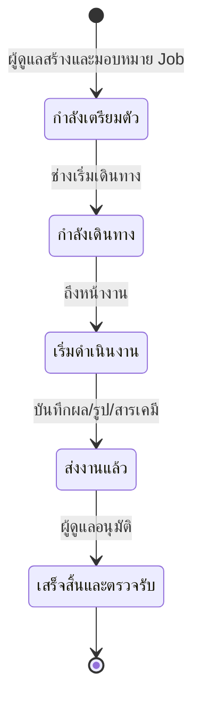
```mermaid
stateDiagram-v2
  [*] --> Preparing: ผู้ดูแลสร้างและมอบหมาย Job
  Preparing: กำลังเตรียมตัว
  Preparing --> Traveling: ช่างเริ่มเดินทาง
  Traveling: กำลังเดินทาง
  Traveling --> Working: ถึงหน้างาน
  Working: เริ่มดำเนินงาน
  Working --> Submitted: บันทึกผล/รูป/สารเคมี
  Submitted: ส่งงานแล้ว
  Submitted --> Accepted: ผู้ดูแลอนุมัติ
  Accepted: เสร็จสิ้นและตรวจรับ
  Accepted --> [*]
```

เมื่ออนุมัติงาน ระบบสร้าง `Contract` และแจ้งลูกค้าผ่าน LINE ตามการตั้งค่า; สถานะของ Problem หรือ Booking ต้นทางจะถูกปรับตามสถานะงานในบางขั้นตอน

## 10. Sequence Diagram: เข้าสู่ระบบ

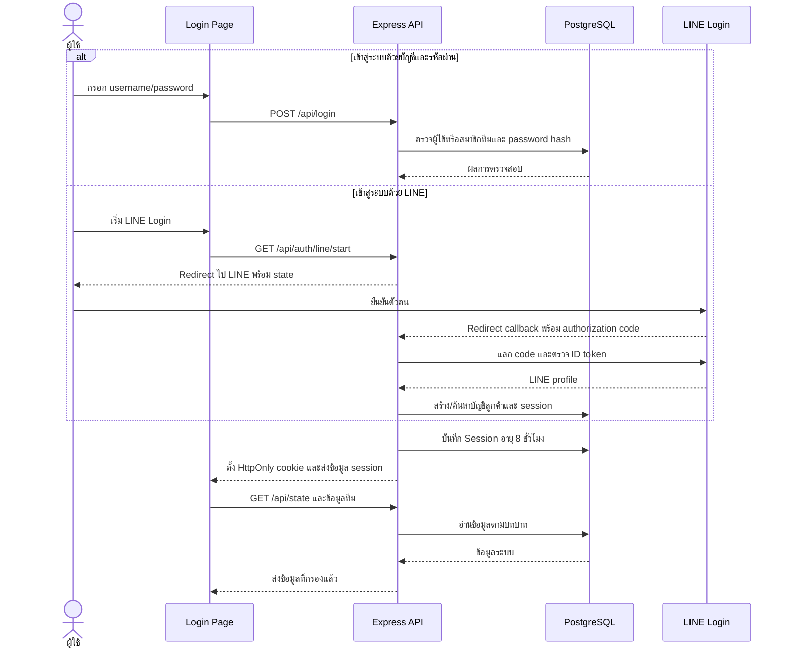
```mermaid
sequenceDiagram
  actor User as ผู้ใช้
  participant UI as Login Page
  participant API as Express API
  participant DB as PostgreSQL
  participant LINE as LINE Login

  alt เข้าสู่ระบบด้วยบัญชีและรหัสผ่าน
    User->>UI: กรอก username/password
    UI->>API: POST /api/login
    API->>DB: ตรวจผู้ใช้หรือสมาชิกทีมและ password hash
    DB-->>API: ผลการตรวจสอบ
  else เข้าสู่ระบบด้วย LINE
    User->>UI: เริ่ม LINE Login
    UI->>API: GET /api/auth/line/start
    API-->>User: Redirect ไป LINE พร้อม state
    User->>LINE: ยืนยันตัวตน
    LINE-->>API: Redirect callback พร้อม authorization code
    API->>LINE: แลก code และตรวจ ID token
    LINE-->>API: LINE profile
    API->>DB: สร้าง/ค้นหาบัญชีลูกค้าและ session
  end
  API->>DB: บันทึก Session อายุ 8 ชั่วโมง
  API-->>UI: ตั้ง HttpOnly cookie และส่งข้อมูล session
  UI->>API: GET /api/state และข้อมูลทีม
  API->>DB: อ่านข้อมูลตามบทบาท
  DB-->>API: ข้อมูลระบบ
  API-->>UI: ส่งข้อมูลที่กรองแล้ว
```

## 11. บทบาทและขอบเขตการเห็นข้อมูล

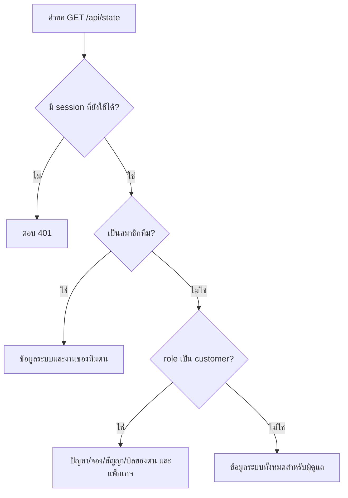
```mermaid
flowchart TD
  Request[คำขอ GET /api/state] --> Auth{มี session ที่ยังใช้ได้?}
  Auth -->|ไม่| Reject[ตอบ 401]
  Auth -->|ใช่| Team{เป็นสมาชิกทีม?}
  Team -->|ใช่| TeamData[ข้อมูลระบบและงานของทีมตน]
  Team -->|ไม่ใช่| Customer{role เป็น customer?}
  Customer -->|ใช่| OwnData[ปัญหา/จอง/สัญญา/บิลของตน และแพ็กเกจ]
  Customer -->|ไม่ใช่| AllData[ข้อมูลระบบทั้งหมดสำหรับผู้ดูแล]
```

สมาชิกทีมถูกจำกัดรายการ Job ตามชื่อทีม ส่วนข้อมูลรายการอื่นใน response ยังคงถูกส่งตามการทำงานใน `GET /api/state`; ลูกค้าถูกกรองปัญหา การจอง สัญญา และใบแจ้งหนี้ตาม `createdBy` หรือชื่อที่แสดง

## 12. กลุ่ม API ตามหน้าที่

| กลุ่ม | Endpoint หลัก |
| --- | --- |
| สุขภาพ/การตั้งค่า | `GET /api/health`, `GET /api/config` |
| ยืนยันตัวตน | `GET /api/me`, `POST /api/login`, `POST /api/register`, `POST /api/logout`, `GET /api/auth/line/start`, `GET /api/auth/line/callback` |
| ข้อมูลและโปรไฟล์ | `GET /api/state`, `GET/PATCH /api/profile` |
| ปัญหาและการจอง | `POST /api/problems`, `POST /api/bookings` |
| งานช่าง | `POST /api/jobs/assign`, `PATCH /api/jobs/:jobId/status`, `POST /api/jobs/:jobId/approve` |
| ใบแจ้งหนี้/สลิป | `POST /api/invoices`, `PATCH /api/invoices/:invoiceId/status`, `POST /api/receipts/ocr`, `POST /api/invoices/:invoiceId/receipt` |
| ทีมและสมาชิก | `GET/POST /api/teams`, `PATCH /api/teams/:teamId`, `GET/POST /api/team-members`, `PATCH/DELETE /api/team-members/:memberId` |
| สัญญา/ข้อมูลตั้งต้น | `PATCH/DELETE /api/contracts/:contractId`, `POST /api/reload` |
